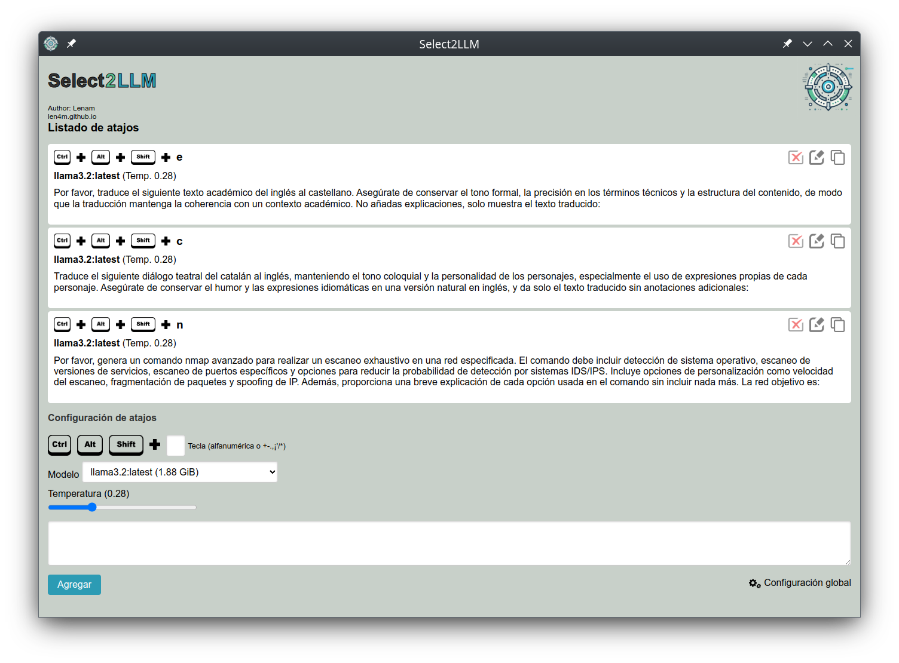

# Select2LLM

**Select2LLM** es una herramienta en desarrollo que permite acceder y procesar texto seleccionado en cualquier aplicación usando modelos de lenguaje (LLMs) cargados en [Ollama](https://ollama.com) con una simple combinación de teclas. La aplicación está diseñada para agilizar tu flujo de trabajo diario, facilitando tareas como traducciones, correcciones, resúmenes, creación de código, informes, generación de comandos, y mucho más.



## Características

- **Acceso rápido y configurable a modelos LLM**: Selecciona texto en cualquier aplicación y envíalo a un modelo de tu elección con una simple combinación de teclas.
- **Soporta múltiples combinaciones de teclas y prompts**: Configura diferentes combinaciones de teclas para acceder a diferentes modelos LLM con distintos prompts predefinidos, añadiendo el texto seleccionado al final del prompt.
- **Gestión de configuraciones desde la aplicación**: La configuración de combinaciones de teclas y prompts se realiza directamente desde la interfaz de la aplicación, sin necesidad de editar archivos manualmente.
- **Flexibilidad de uso**: Procesa el texto seleccionado con cualquier modelo LLM cargado en Ollama para generar respuestas de manera ágil y eficiente.
- **Privacidad de tus datos**: Al utilizar Ollama, evitas depender de APIs externas (como OpenAI) y mantienes la privacidad de tus datos procesados.

## Requisitos

Actualmente, Select2LLM ha sido testeada solo en sistemas **Linux con X11**. Sin embargo, la programación está diseñada para permitir futuras adaptaciones a **Windows** y **macOS**. Los requisitos para utilizar la aplicación en Linux son:

- Tener instalado [Ollama](https://ollama.com) con al menos un modelo descargado.
- Tener instalados `xclip` y `xdotool` para acceder al portapapeles y simular pulsaciones de teclas.

## Instalación

1. **Clonar el repositorio**
    ```bash
    git clone https://github.com/tuusuario/Select2LLM.git
    ```
   
2. **Instalar dependencias**
    Navega a la carpeta del proyecto y ejecuta el siguiente comando para instalar las dependencias:
    ```bash
    npm install
    ```

3. **Construir la aplicación**
    Para crear un archivo ejecutable `.AppImage` de Select2LLM en la carpeta `dist`, usa el siguiente comando:
    ```bash
    npm run build
    ```

4. **Ejecutar la aplicación**
    Si deseas iniciar la aplicación sin crear un `.AppImage`, puedes utilizar:
    ```bash
    npm start
    ```

## Configuración de combinaciones de teclas y prompts

La configuración de combinaciones de teclas y prompts se realiza directamente desde la interfaz de la aplicación. Los ajustes se guardan automáticamente en un archivo `shortcuts.json` que se encuentra en la carpeta del usuario, dentro de `.select2llm`.

El formato de este archivo es el siguiente:

```json
[
  {
    "ctrl": true,
    "shift": true,
    "alt": true,
    "key": "t",
    "prompt": "Traduce el siguiente texto al inglés. Devuelve únicamente la traducción en inglés sin incluir ningún comentario, explicación ni texto adicional:",
    "model": "llama3.2:latest"
  },
  {
    "ctrl": true,
    "shift": true,
    "alt": true,
    "key": "p",
    "prompt": "Mejora esta programación para que sea más corta y más eficiente, muéstrame solo la programación sin incluir ningún comentario, explicación ni texto adicional:",
    "model": "mistral:instruct"
  },
  {
    "ctrl": true,
    "shift": true,
    "alt": true,
    "key": "r",
    "prompt": "Resume el siguiente contenido mencionando las cosas más importantes en 2 párrafos:\n%s",
    "model": "llama3.2:latest"
  }
]
```
- **ctrl, shift, alt**: Valores booleanos que definen si estas teclas deben ser parte de la combinación.
- **key**: La tecla principal que activará el prompt.
- **prompt**: El mensaje que se enviará al modelo LLM, con el texto seleccionado añadido al final o donde se encuentre **%s**.
- **model**: El modelo LLM cargado en Ollama que se utilizará para procesar el texto.

## Uso

1. Selecciona cualquier texto en una aplicación de tu computadora.
2. Usa la combinación de teclas configurada para enviar el texto seleccionado al modelo LLM preconfigurado en Ollama.
3. Recibe la respuesta procesada y disfruta de la eficiencia en tu flujo de trabajo.

La aplicación utiliza el portapapeles y xdotool para acceder al contenido seleccionado en otras aplicaciones y simular pulsaciones de teclas.

## Motivación del proyecto

La idea detrás de Select2LLM surgió por la frustración de tener que buscar plugins para ChatGPT/Ollama en cada aplicación donde quería usar LLMs, lo cual resultaba en una experiencia deficiente y, generalmente, terminaba en la API de OpenAI, sacrificando la privacidad de mis datos procesados. Con Select2LLM, ahora es posible acceder a diferentes modelos y prompts preconfigurados con solo una pulsación de teclas, haciendo que cualquier tarea sea más eficiente.

## Colaboración

Select2LLM es la primera aplicación que desarrollo en Electron, por lo que es muy probable que haya errores y muchas cosas por mejorar. ¡Toda colaboración es bienvenida! Si tienes sugerencias, mejoras o simplemente quieres contribuir, no dudes en abrir un issue o crear un pull request en el repositorio.

## Licencia

Este proyecto está licenciado bajo la Licencia GPL-3. Consulta el archivo LICENSE para más detalles.